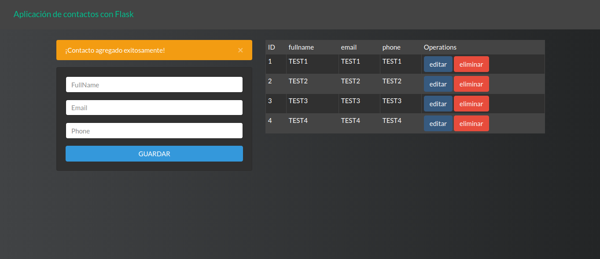

# FlaskApp

[](https://t.me/valentin_99)


Aplicación con Flask y MySQL para agregar, actualizar y eliminar contactos 

# Screenshot


# install dependencies
```bash
- pip install flask
- pip install flask-mysqldb
```
## documentation 📖

> Puedes encontrar mucho más información en [Flask.](https://flask.palletsprojects.com/)


---
⌨️ [JoseVale99](https://gist.github.com/JoseVale99) 😊

